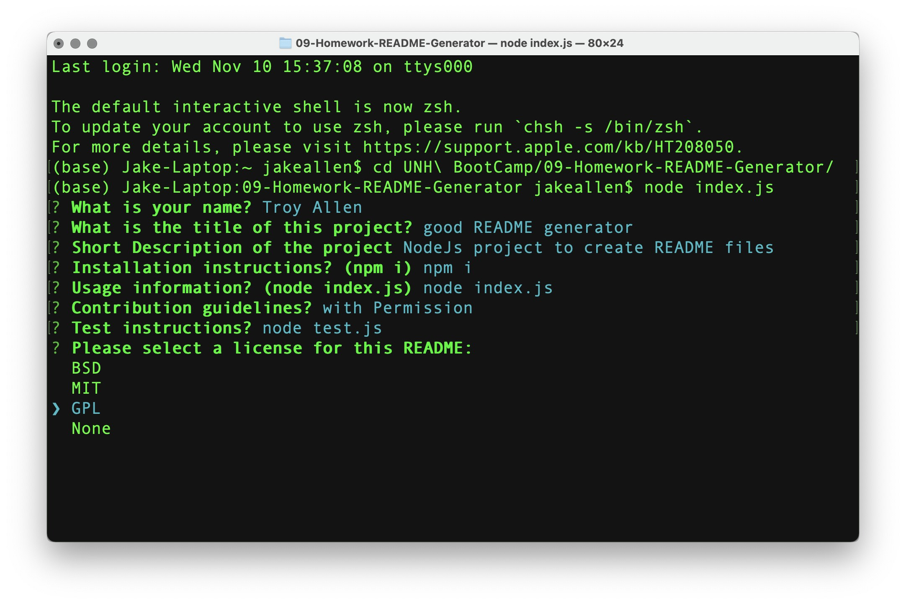

  
  
  # README Generator
  ## Description
  NodeJS project to create README files based on user input
  
  ## Table of Contents
  - [Installation](#installation)
  - [Usage](#usage)
  - [Contributing](#contributing)
  - [License](#license)
  - [Questions](#questions)
  ## Installation
  npm i
  ## Usage
  node index.js
      
  ## Contributing
  with permission
  
  
  ## License
  This project is protected under MIT License.

[License Documentation](https://opensource.org/licenses/MIT)
  ## Questions
  [Refer to Github Profile: tallen1985](http://www.github.com/tallen1985)
  
  Any additional questions, reach me at my email jake.allen@me.com

  ## Link to Video
  [Link to Video Demonstration](https://drive.google.com/file/d/193HhBhpt9wfd1zkMJdvom33mQA6KZCjt/view?usp=sharing)

  ## ScreenShot
  
  
